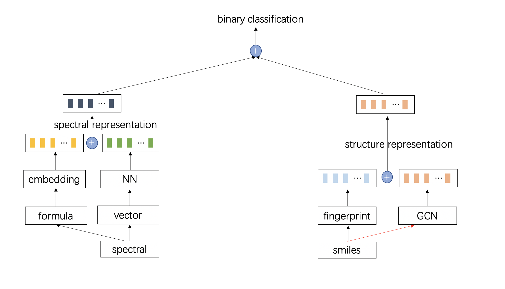

### readme

---

任务：

利用物质的二级谱图信息，它的同分异构体作为候选，找出准确的结构

数据集：

GPNS

评价指标:

top1,top5,1op10的准确性

---

数据集格式：

（带*号的为文件夹）

GPNS原始数据：

| 文件          | 信息                                                     |
| ------------- | -------------------------------------------------------- |
| *spectral     | 物质的二级谱图，命名规则:CCMSLIB000000\****.csv          |
| *formula_sdf  | 每个分子所有同分异构体的结构信息，命名规则:[formula].pkl |
| *sdf          | 每个物质的结构信息，命名规则:[cid号].pkl                 |
| GPNS_inf.csv  | 二级谱图名字对应的分子式和cid号                          |
| group_inf.csv | 交叉验证的分组信息                                       |


GPNS经过处理的数据：

| 文件           | 信息                                                         | 单个文件（单条数据）格式                                     |
| -------------- | ------------------------------------------------------------ | ------------------------------------------------------------ |
| *fingerid      | 利用rdKit库对sdf文件提取出的fid，每个分子式保存一个pkl,pkl保存的是一个list | ```[[fingerid1], [fingerid2], ...]```                        |
| for2smiles.pkl | 查询每个分子式对应哪些同分异构体的，pkl保存的是一个字典      | ```{'formula1':[smiles1, smiles2, ...],'formula2':[smiles1, smiles2, ...]}``` |
| ms_data.pkl    | 为了训练方便，把需要的训练数据整合到一起,pkl保存的是一个dataframe | ```{'id':id, 'formula':formula, 'mz':mz, 'intensity':intensity, 'smiles':smi, 'group':group, 'csv_name':csv_name}``` |
|                |                                                              |                                                              |


*fingerid, for2smiles.pkl可以通过在```./process```下运行 extra_fid.py得到

ms_data.csv可以通过在```./process```下运行gather_data.pk得到


---

代码结构:

str_code:

* data
  * original_data
  * process_data
*  process(对数据进行预处理)：
  * extra_fid.py
  *  gather_data.py
* data_load(读取数据集)
  * load.py
* models(模型文件)
  * model.py
* train.py
* utils.py(存放工具函数)

---

模型结构

baseline:

